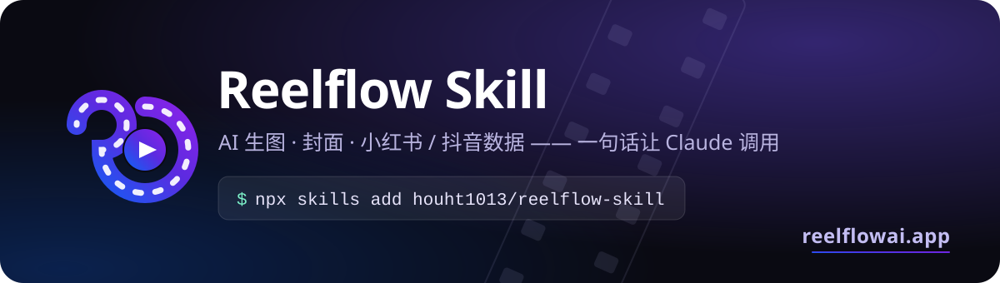
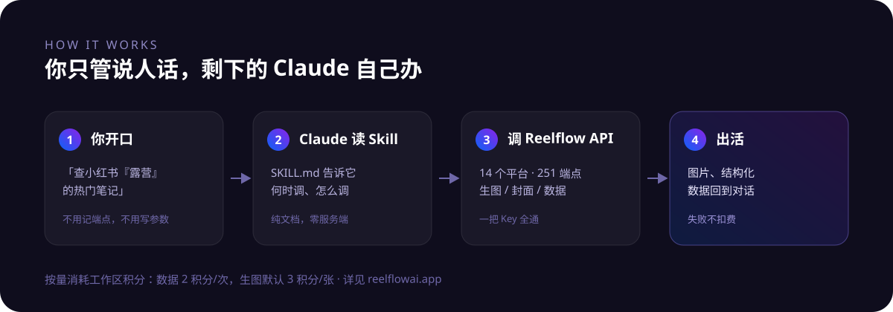

<p align="center">
  <a href="https://reelflowai.app"></a>
</p>

<p align="center">
  <a href="https://reelflowai.app"></a>
  <a href="https://reelflowai.app/docs/api"></a>
  
  
  <a href="LICENSE"></a>
</p>

<p align="center">
  <b>把 <a href="https://reelflowai.app">Reelflow</a> 装成你 AI Agent 的技能</b><br>
  AI 生图 / 平台封面图 · 小红书、抖音等 <b>14 个平台</b>的公开数据 —— 直接对 Agent（Claude Code / Codex / Cursor 等）说人话就行
</p>

---

## 装它之前，你得这样干

```
打开网页 → 找端点文档 → 复制 curl → 改参数 → 调试鉴权 → 解析 JSON → 手动整理
```

## 装完之后

> **你**：查一下小红书「露营」最近的爆款笔记，挑三条整理成表格
>
> **Agent**：*（自己调 API、翻页、去重、排版）* 好了，按点赞排序的前三条在这儿——

一句话的事。不用记端点，不用查参数，不用碰鉴权。

<p align="center"></p>

## 能做什么

| 你说 | 它干 |
|---|---|
| 「生成一张手冲咖啡教程的封面，3:4 竖版」 | 调生图 API 出图，尺寸/风格按平台预设走 |
| 「一次出 4 张，我挑一张」 | 同提示词并行生成，失败那张不计费 |
| 「查小红书『露营』的热门笔记」 | 搜笔记、翻页、取互动数据 |
| 「这条笔记的评论里大家在吐槽什么」 | 拉评论，自己归纳 |
| 「抖音『AI 工具』这周热榜」 | 热榜、话题、达人数据 |
| 「这个博主的蒲公英报价多少」 | 小红书蒲公英商业数据 |
| 「先看看我还剩多少积分」 | 查余额 |

覆盖 **小红书 / 抖音 / TikTok / Bilibili / 快手 / 微博 / 视频号 / 微信公众号 / 知乎 / YouTube / Twitter / Instagram / Threads / Reddit**，共 251 个端点，一把 Key 全通。完整清单见 [API 文档](https://reelflowai.app/docs/api)。

## 三步开始

### 1. 安装

```bash
npx skills add houht1013/reelflow-skill
```

<details>
<summary>手动安装（或想装到某个项目里）</summary>

```bash
# Claude Code（全局）
git clone https://github.com/houht1013/reelflow-skill.git ~/.claude/skills/reelflow

# Codex（全局）
git clone https://github.com/houht1013/reelflow-skill.git ~/.codex/skills/reelflow

# 只给当前项目（按你的 Agent 换目录，如 .claude/skills、.codex/skills）
git clone https://github.com/houht1013/reelflow-skill.git .claude/skills/reelflow
```

> `npx skills add` 会自动检测本机已装的 Agent（Claude Code / Codex / Cursor 等）并询问安装位置。

</details>

### 2. 拿 Key

去 [reelflowai.app](https://reelflowai.app/zh-CN/reelflow/api-keys) 注册并创建 API Key，然后：

```bash
export REELFLOW_API_KEY="rf_your_api_key"
```

写进 `~/.zshrc` / `~/.bashrc` 就一劳永逸。

### 3. 说话

```
用 reelflow 生成一张封面图，主题是「三步冲出好咖啡」
用 reelflow 查小红书「露营」的热门笔记
先查一下我的 reelflow 积分余额
```

Agent（Claude Code / Codex / Cursor 等）会自己读 `SKILL.md` 判断该不该调、怎么调。

## 计费

| 项目 | 价格 |
|---|---|
| 平台数据查询 | 2 积分 / 次 |
| AI 生图 | 3 积分 / 次 |
| **失败的请求** | **不扣费** |

积分在 [reelflowai.app](https://reelflowai.app/zh-CN/reelflow/credits) 充值或订阅套餐获得，响应里带确切的 `creditsTotal`。余额不足返回 `402`，Agent 会直接告诉你去充值而不是傻重试。

## 仓库里有什么

| 文件 | 作用 |
|---|---|
| `SKILL.md` | 主入口，Agent 读它决定何时调用 |
| `references/getting-started.md` | 配 Key、首次使用、401 排查 |
| `references/image-cover.md` | 生图与封面：尺寸、模型、批量 |
| `references/xhs-data.md` | 小红书数据端点用法 |
| `scripts/api.mjs` | 零依赖调用助手（Node ≥ 18） |

参数细节以 `GET https://api.reelflowai.app/v1/openapi` 为准 —— Skill 只写高频用法，避免文档和实现漂移。

## 更喜欢 MCP？

Skill 用开放 Agent Skills 格式，Claude Code / Codex / Cursor 等都能装。你也可以走 **MCP**，同源同计费：

```bash
# Claude Code
claude mcp add --transport http reelflow https://api.reelflowai.app/mcp \
  --header "Authorization: Bearer $REELFLOW_API_KEY"
```

```toml
# Codex（~/.codex/config.toml）
[mcp_servers.reelflow]
url = "https://api.reelflowai.app/mcp"
bearer_token_env_var = "REELFLOW_API_KEY"
```

Cursor 等支持 MCP 的客户端同理。也可以直接 `curl` 打 REST API。三种形态任选，见 [接入文档](https://reelflowai.app/docs/api)。

## 常见问题

<details>
<summary>Agent 没有自动调用怎么办？</summary>

先确认 skill 装对了位置（如 `~/.claude/skills/reelflow/SKILL.md` 或 `~/.codex/skills/reelflow/SKILL.md` 存在），再在话里明确带上「reelflow」这个词。Agent 是按 `SKILL.md` 的 description 匹配的。

</details>

<details>
<summary>报 401 / 403</summary>

九成是 `REELFLOW_API_KEY` 没设或设错了。`echo $REELFLOW_API_KEY` 看一眼；新开的终端要重新 source。详见 `references/getting-started.md`。

</details>

<details>
<summary>数据是实时的吗？</summary>

是直连平台公开数据，非缓存。只覆盖公开可见内容。

</details>

---

<p align="center">
  <a href="https://reelflowai.app"><b>reelflowai.app</b></a> ·
  <a href="https://reelflowai.app/docs/api">API 文档</a> ·
  <a href="https://reelflowai.app/zh-CN/reelflow/api-keys">获取 API Key</a> ·
  <a href="https://reelflowai.app/zh-CN/pricing">定价</a>
</p>

<p align="center"><sub>MIT License · 本仓库由 Reelflow 主仓库单向同步，请勿直接提交改动</sub></p>
